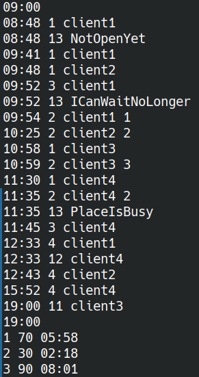
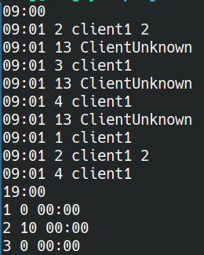
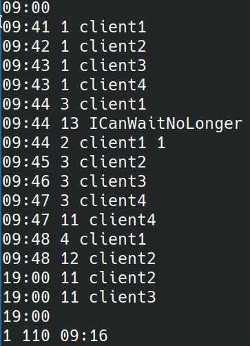
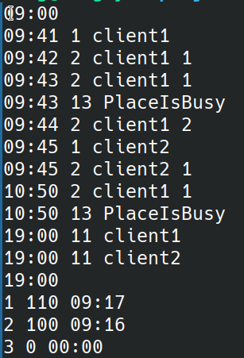
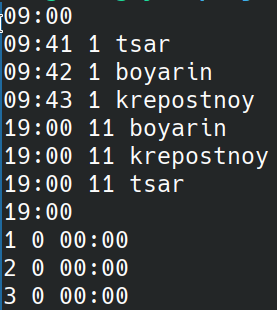
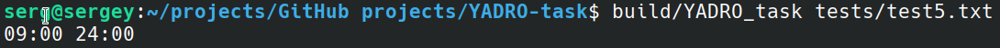
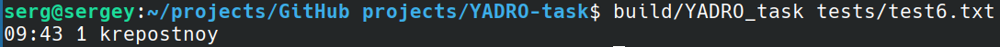

# YADRO TASK
Программа написана в качестве решения задания для компании YADRO на вакансию стажера "Инженер по разработке ПО для базовых станций (C++)"
## Запуск программы
Программа компилируется в ОС Linux

Клонирование репозитория

```git clone https://github.com/hakimaro/YADRO-task```

Переход в рабочую папку

```cd YADRO-task```

Сборка проекта

```cmake -S . -B build```

```cmake --build build```

Запуск проекта

```build/YADRO_task tests/test.txt```

## Примеры работы
1. ```test.txt``` - Пример из задания



2. ```test1.txt``` - Пример обработки ошибки ClientUnknown



3. ```test2.txt``` - Пример работы с очередью ожидания (добавление в неё, посадка первого ожидающего после ухода клиента, сидящего за столом, уход из клуба, если размер очереди больше числа столов, обработка ошибки "ICanWaitNoLonger")



4. ```test3.txt``` - Пример пересадки человека с одного стола на другой



5. ```test4.txt``` - Пример вывода клиентов в алфавитном порядке при закрытии клуба



6. ```test5.txt``` - Пример обработки ошибки ввода времени



7. ```test6.txt``` - Пример обработки ошибки последовательности событий по времени (должны быть по возрастанию)


